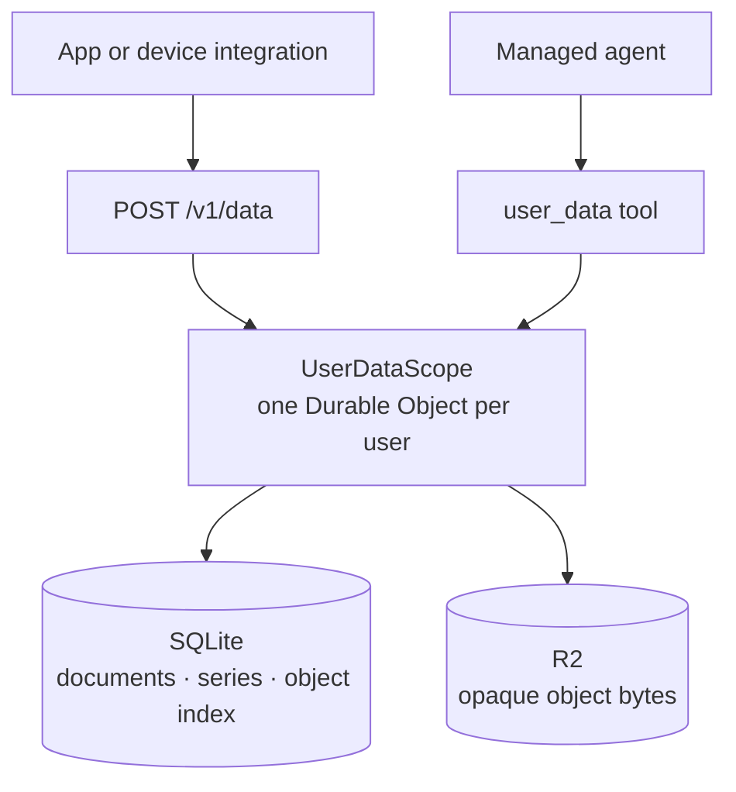

# Per-user data

The managed Nanocodex service gives every account a private general-purpose data
store. The same closed operation contract is available through `POST /v1/data` and
the managed agent's `user_data` tool.



This deliberately is not raw D1 or R2 passthrough. A deployment-wide D1 database
would make every query responsible for an easy-to-miss tenant predicate. Naming one
SQLite-backed Durable Object from the authenticated user ID gives each user a real
transaction and storage boundary. R2 bodies share a bucket but use a server-derived,
hashed user prefix; callers never receive a bucket credential or physical R2 key.

## Storage interface and limits

Each user has a separate SQLite database inside a Durable Object. Applications
access its fixed document, object-index, and time-series operations; this API does
not accept arbitrary SQL, custom tables, joins, or schema migrations.

Object storage is a logical private namespace in one shared R2 bucket, rather than
a separately provisioned bucket for every user. The API supports bounded JSON
uploads/downloads and listing/deletion, not the S3 wire protocol, bucket credentials,
presigned URLs, multipart uploads, streaming downloads, or range requests. Existing
S3 SDKs cannot target `/v1/data` directly. Time-series data currently has no delete
or retention operation, and this feature does not add per-account storage quotas.

## Data models

| Model | Operations | Intended use |
| --- | --- | --- |
| Documents | `document_put`, `document_get`, `document_list`, `document_delete` | Profiles, device configuration, integration state, structured records. |
| Time series | `timeseries_write`, `timeseries_list`, `timeseries_query`, `timeseries_aggregate` | Numeric telemetry with millisecond timestamps and optional JSON fields. |
| Objects | `object_put`, `object_get`, `object_list`, `object_delete` | Raw captures, exports, media, and other opaque UTF-8 or base64 payloads. |

Documents and objects receive monotonically increasing versions, including after
a key is deleted and recreated. Supplying
`if_version` makes an update or delete conditional, so a stale writer gets `409`
instead of overwriting a newer value. Identical puts are idempotent and leave the
version unchanged. Conditional puts always check `if_version` first: retrying a
successful conditional update with its old version returns `409`; read back the
current value to reconcile an uncertain result. Deletes of missing keys return
`404`. Delete receipts include only key/version, so a write-only grant cannot
retrieve the previous value or metadata.

Each R2 upload uses a unique immutable physical key. SQLite commits its metadata
only if the observed logical version still matches; concurrent conditional writes
produce one winner and a `409` for stale writers. A durable cleanup queue records
uploads before R2 I/O, and alarms remove abandoned or superseded payloads after a
one-hour grace period. Logical deletion is immediate; physical payload cleanup is
eventual and retries on R2 failure. Versions and cleanup records remain private.

A time-series point is identified by `(series, timestamp_ms)`. Replaying an identical
point is idempotent. The default `conflict: "error"` preserves the existing point;
`"replace"` must be chosen explicitly. Queries are cursor-paged and can be bounded by
time. Aggregation supports `avg`, `min`, `max`, `sum`, and `count` over caller-chosen
buckets.

Object bytes are hashed again inside the user Durable Object. An optional caller
`sha256` is checked before the versioned metadata record is committed. JSON uploads
are bounded at 1 MiB decoded size, and the complete streamed JSON request is
limited to 2 MiB. Documents allow 256 KiB JSON; metadata and individual point fields
allow 16 KiB. JSON values have at most 32 nesting levels and 50,000 nodes.
List/query pages default to 100 and accept up to 1,000 entries; they may return
fewer entries to stay within an approximately 1 MiB data budget. Follow the returned
cursor until absent, keeping filters/order unchanged. Prefixes are literal and
case-sensitive. Pages are live reads, not a snapshot across concurrent writes.
One series write accepts up to 5,000 points within the request limit. Aggregations
span at most 1,000 buckets and use inclusive start/end timestamps.

## HTTP examples

An account API key uses the same bearer authentication as other managed routes:

```sh
curl https://nanocodex.gakonst.workers.dev/v1/data \
  -H "Authorization: Bearer $NANOCODEX_API_KEY" \
  -H 'Content-Type: application/json' \
  --data '{
    "operation":"document_put",
    "key":"com.example/device/profile",
    "value":{"model":"tracker-v1","worn_on":"left"}
  }'
```

```sh
curl https://nanocodex.gakonst.workers.dev/v1/data \
  -H "Authorization: Bearer $NANOCODEX_API_KEY" \
  -H 'Content-Type: application/json' \
  --data '{
    "operation":"timeseries_write",
    "series":"whoop.heart_rate_bpm.source.live",
    "points":[
      {"timestamp_ms":1789344000000,"value":72,"fields":{"device_id":"strap-1"}}
    ]
  }'
```

Read a time range or summarize it into five-minute averages:

```json
{"operation":"timeseries_query","series":"whoop.heart_rate_bpm.source.live","start_ms":1789344000000,"end_ms":1789430400000,"limit":1000}
```

```json
{"operation":"timeseries_aggregate","series":"whoop.heart_rate_bpm.source.live","start_ms":1789344000000,"end_ms":1789430400000,"bucket_ms":300000,"aggregation":"avg"}
```

The agent calls `user_data` with these exact JSON bodies. There is no separate model
translation layer, which keeps device integrations and agent behavior on one contract.

## Authorization and Connect

Reads require `data:read`; puts and deletes require `data:write`. Newly issued owner
API keys include these capabilities. Existing API keys and Connect grants retain
their previously issued capabilities; deployment does not silently expand them.

For an existing direct login, the agent can call `request_permissions`:

```json
{"operation":"request","operation_id":"22cb21f6-c22d-4fa1-8386-5508e73d23a9","capabilities":["data:read","data:write"],"reason":"Save and read this app's records and files."}
```

The user reviews the exact permissions and target login in the native app or the
returned account-page link. The authenticated account page approves or denies. The tool has no
approval operation. Approval adds only the requested permissions to the existing
key; its value and account stay unchanged. All clients using that key gain the
approved access. Decisions require the owner's persistent browser account session
with `api_keys:write`; an API key cannot approve its own expansion, even if it
contains that capability. An already signed-in browser needs no fresh login.
Legacy native-only logins must verify the owner in the browser if no account
session exists there. The app keeps its existing key throughout this step.
Current account membership still limits every approval.

Pending, denied and expired requests grant nothing. Reuse `operation_id` with the
same arguments after uncertain delivery; use `{"operation":"status","request_id":"…"}`
to read the actual receipt. An approved status refreshes the current root turn;
a new user turn on an already-open chat socket also revalidates the same key.
Retained jobs, replayed turns and existing subagents do not automatically inherit new authority.
No storage operation is automatically repeated by consent.

The equivalent public API is `POST /v1/permission-requests` with the request body
above minus `operation`, `GET /v1/permission-requests/:keyID/:requestID`, and
`POST /v1/permission-requests/:keyID/:requestID/approve` or `/deny`. Decisions
require an exact same-origin `Origin` header and the authenticated owner authority
described above. Requests expire after 15 minutes; replay receipts are retained
for seven days, with at most 128 retained requests per key. Revoked keys and stale
membership epochs fail closed. API-key and organization administration scopes
cannot be requested through this flow.

Connect apps can request the exact resources `urn:nanocodex:data:read` and
`urn:nanocodex:data:write`; the broker binds the app and grant identity before
forwarding the operation.

Provider credentials remain in the credential broker. The data API and tool accept no
credential operation, and integrations should never put provider tokens into a
document, series field, or object. Pagination plus object reads is also the portable
export path: logical keys and content are exposed, while physical Durable Object IDs,
R2 keys, and broker secrets are not.

Before the first managed deployment, create the R2 bucket referenced by the checked-in
Worker configuration:

```sh
pnpm --dir js/managed exec wrangler r2 bucket create nanocodex-user-data
```

The `v14` Worker migration creates the `UserDataScope` Durable Object class during the
normal managed deployment.

## Synthetic device integration example

A fictional wearable integration can retain a gzip capture in its own durable
outbox before submitting data. Its worker then:

1. verifies and uploads the raw batch to
   `com.example.wearable/raw/<content-sha256>.json.gz`;
2. converts validated measurements to a series such as
   `com.example.wearable.heart_rate_bpm`;
3. retains decoder, source, and device context as point fields; and
4. retries transient failures using identical object content and point identities.

Unknown packet fields stay in the raw object. A later decoder can derive a new named
series without rewriting the source capture. This is an illustrative workflow;
it does not assert that an external integration has been implemented or verified.

## Local verification

Run `pnpm --dir js/nanocodex-tools build`, then
`pnpm --dir js/managed test:user-data`. The dedicated Workers suite sends requests
through the Worker HTTP handler into real local Durable Object SQLite and R2. The Workers tests substitute only external identity enrollment. A second journey
uses the real account proxy and locally issued API keys over HTTP, then restarts
workerd with persisted SQLite/R2 stores to verify data, version, and credential
survival. Logs and `output/user-data/persistence-http-trace.json` retain the
expected/observed HTTP results. Narrow internal hooks inject missing/corrupt R2
bytes and advance cleanup deadlines because these failures are not public actions.
Production credential enrollment, abrupt process crashes, R2 outages, and live
Cloudflare deployment are outside this suite.
